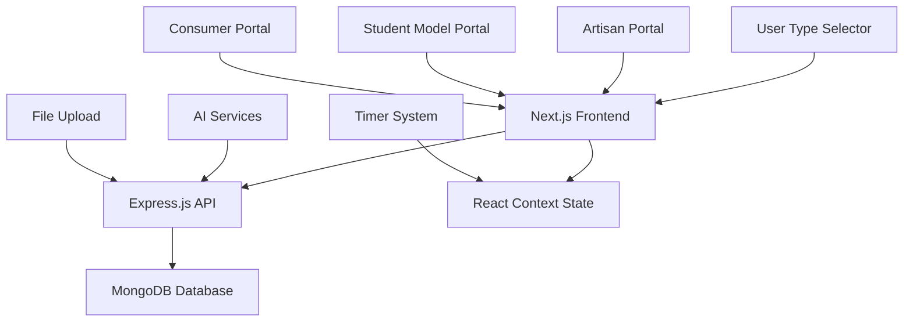

# 🎨 Looma: The Artisan Intelligence Platform

[](https://nextjs.org/)
[](https://www.typescriptlang.org/)
[](https://expressjs.com/)
[](https://www.mongodb.com/)

Looma is a comprehensive 3-part platform that revolutionizes the handloom and artisan industry by connecting **Artisans**, **Student Models**, and **Consumers** in a seamless ecosystem. Built with modern web technologies, it provides intelligent project management, trend analysis, and marketplace functionality for the traditional craft industry.

## 🏗️ The 3-Part System

### 🧵 **Artisan Portal** - The Creative Workspace
- **Project Management**: Complete logging system with timer functionality for tracking work hours
- **Inventory Management**: Raw materials tracking with low-stock notifications and surplus marketplace
- **Trend Analysis**: AI-powered trend discovery and market insights
- **Student Model Integration**: Connect with student models for product showcasing
- **Multi-Stage Workflow**: Preparation → Preweaving → Weaving → Finishings → Completed

### 👗 **Student Model Portal** - The Showcase Hub
- **Profile Management**: Comprehensive model profiles with photos, measurements, and bio
- **Connection System**: Direct connection with artisans for collaborative projects
- **Financial Management**: Set and manage minimum asking prices for modeling work
- **Project Tracking**: View upcoming shoots and project schedules
- **Communication Tools**: Direct messaging with connected artisans

### 🛒 **Consumer Portal** - The Marketplace Experience
- **Product Discovery**: Browse handcrafted items from verified artisans
- **AI-Powered Requests**: Submit custom requests using voice, text, or images
- **Attribute Extraction**: AI analyzes requests to extract color, style, fabric preferences
- **Personalized Content**: Tailored recommendations, deals, and artisan stories
- **Shopping Cart**: Complete e-commerce functionality with customization options

## ✨ Key Features

### 🎨 **Artisanal Design System**
- **Warm Color Palette**: Inspired by precious materials (Zari Gold, Royal Purple, Silk Emerald)
- **Lora Serif Font**: Elegant typography that reflects traditional craftsmanship
- **Paper Texture Background**: Authentic artisanal feel with subtle texture
- **Fluid Animations**: Smooth Framer Motion transitions throughout the interface

### ⚡ **Real-Time Functionality**
- **Live Timer System**: Track work hours with start/pause/resume/stop functionality
- **Dynamic Progress Tracking**: Visual progress bars representing project completion
- **Instant Notifications**: Low stock alerts and project updates
- **Real-Time Updates**: Live data synchronization across all portals

### 🤖 **AI Integration**
- **Voice Recognition**: Convert voice requests to structured data
- **Image Analysis**: Extract attributes from uploaded images
- **Smart Recommendations**: Personalized content based on user preferences
- **Trend Prediction**: Analyze market data for informed decision making

## 🏗️ Architecture



### System Components

1. **Frontend Layer** (Next.js 14 + TypeScript)
   - 🎨 **Multi-Portal Interface**: Three distinct user experiences in one application
   - ⚛️ **React Context**: Centralized state management for all user types
   - 🎭 **Component Library**: Reusable UI components with consistent design system
   - 📱 **Responsive Design**: Mobile-first approach with Tailwind CSS

2. **Backend API** (Express.js + Node.js)
   - 🚀 **RESTful Endpoints**: Complete CRUD operations for all entities
   - ⏱️ **Timer Management**: Real-time project time tracking
   - 📊 **Data Processing**: Raw materials, projects, and items management
   - 🔔 **Notification System**: Low stock alerts and project updates

3. **Database Layer** (MongoDB)
   - 📦 **Projects Collection**: Complete project lifecycle management
   - 🧵 **Raw Materials**: Inventory tracking with stock levels
   - 👥 **Users**: Artisan, student model, and consumer profiles
   - 🛒 **Marketplace**: Product listings and consumer requests

4. **AI Integration Layer**
   - 🎤 **Voice Processing**: Convert voice requests to structured data
   - 🖼️ **Image Analysis**: Extract attributes from uploaded images
   - 🤖 **Attribute Extraction**: AI-powered request analysis
   - 📈 **Trend Analysis**: Market insights and recommendations

## 🛠️ Tech Stack

<table>
<tr>
<th>Frontend</th>
<th>Backend & Database</th>
<th>AI & Integrations</th>
</tr>
<tr>
<td>

- ▲ **Next.js 14** - React framework with App Router
- ⚛️ **React 18** - UI library with hooks
- 📘 **TypeScript** - Type safety and development experience
- 💨 **Tailwind CSS** - Utility-first styling
- ✨ **Framer Motion** - Smooth animations and transitions
- 🎨 **Lucide React** - Beautiful icon library
- 📝 **Lora Font** - Elegant serif typography

</td>
<td>

- 🚀 **Express.js** - Node.js web framework
- 📦 **Node.js** - JavaScript runtime
- 🍃 **MongoDB** - NoSQL database
- 🔌 **Mongoose** - MongoDB object modeling
- ⏱️ **Real-time Timers** - Project time tracking
- 📊 **RESTful APIs** - Complete CRUD operations
- 🔔 **Notification System** - Low stock and project alerts

</td>
<td>

- 🎤 **Web Speech API** - Voice recognition
- 🖼️ **Image Processing** - File upload and analysis
- 🤖 **AI Attribute Extraction** - Request analysis
- 📈 **Trend Analysis** - Market insights
- 🎯 **Personalization** - Smart recommendations
- 📱 **Responsive Design** - Mobile-first approach

</td>
</tr>
</table>

## 🚀 Quick Start

### Prerequisites

- 📦 **Node.js** (v18.x or later)
- 🍃 **MongoDB** (local installation or MongoDB Atlas)
- 📝 **Git** (for cloning the repository)

### 1. Clone and Setup

```bash
# Clone the repository
git clone https://github.com/your-username/looma.git
cd looma

# Install frontend dependencies
npm install

# Install backend dependencies
cd backend
npm install
cd ..
```

### 2. Database Setup

```bash
# Start MongoDB (if running locally)
mongod

# Or use MongoDB Atlas connection string in your environment variables
```

### 3. Start the Application

```bash
# Start the backend server (Terminal 1)
cd backend
npm run dev

# Start the frontend development server (Terminal 2)
npm run dev
```

🎉 **Backend API**: `http://localhost:3001`  
🌟 **Frontend**: `http://localhost:3000`

### 4. Access the Platform

1. **Artisan Portal**: Default view for project management and inventory
2. **Student Model Portal**: Navigate to `/student-dashboard` for model management
3. **Consumer Portal**: Switch to consumer mode for marketplace experience

## 📡 API Reference

### Projects Management
| Method | Endpoint | Description |
|--------|----------|-------------|
| `GET` | `/api/projects` | 📋 Get all projects |
| `GET` | `/api/projects/:id` | 📄 Get single project |
| `POST` | `/api/projects` | ➕ Create new project |
| `PUT` | `/api/projects/:id` | ✏️ Update project |
| `DELETE` | `/api/projects/:id` | 🗑️ Delete project |
| `PATCH` | `/api/projects/:id/stage` | 🔄 Update project stage |
| `PATCH` | `/api/projects/:id/timer` | ⏱️ Update project timer |

### Raw Materials Management
| Method | Endpoint | Description |
|--------|----------|-------------|
| `GET` | `/api/raw-materials` | 🧵 Get all raw materials |
| `GET` | `/api/raw-materials/:id` | 📄 Get single raw material |
| `POST` | `/api/raw-materials` | ➕ Create new raw material |
| `PUT` | `/api/raw-materials/:id` | ✏️ Update raw material |
| `DELETE` | `/api/raw-materials/:id` | 🗑️ Delete raw material |
| `PATCH` | `/api/raw-materials/:id/stock` | 📊 Update stock quantity |

### Timer Management
| Method | Endpoint | Description |
|--------|----------|-------------|
| `POST` | `/api/projects/:id/timer/start` | ▶️ Start project timer |
| `POST` | `/api/projects/:id/timer/pause` | ⏸️ Pause project timer |
| `POST` | `/api/projects/:id/timer/resume` | ▶️ Resume project timer |
| `POST` | `/api/projects/:id/timer/stop` | ⏹️ Stop project timer |
| `GET` | `/api/projects/:id/timer/status` | 📊 Get timer status |

### Example API Usage

```javascript
// Create a new project
const newProject = await fetch('/api/projects', {
  method: 'POST',
  headers: { 'Content-Type': 'application/json' },
  body: JSON.stringify({
    type: 'Saree',
    name: 'Wedding Collection',
    remarks: 'Traditional handwoven silk',
    deadline: '2024-12-31',
    currentStage: 'Preparation'
  })
});

// Start timer for a project
const timerResponse = await fetch('/api/projects/123/timer/start', {
  method: 'POST'
});

// Get low stock notifications
const notifications = await fetch('/api/notifications/low-stock');
```

## 📁 Project Structure

```
looma/
├── 📁 backend/                        # Express.js API Server
│   ├── server.js                      # Main Express application
│   ├── package.json                   # Backend dependencies
│   └── README.md                      # Backend documentation
│
├── 📁 src/                           # Next.js Frontend Application
│   ├── 📁 app/                       # Next.js App Router
│   │   ├── page.tsx                  # Main landing page with user type selector
│   │   ├── student-dashboard/        # Student model portal
│   │   │   └── page.tsx              # Student dashboard page
│   │   ├── layout.tsx                # Root layout with providers
│   │   └── globals.css               # Global styles and design system
│   │
│   ├── 📁 components/                # Reusable UI Components
│   │   ├── 🧵 artisan-dashboard.tsx  # Main artisan interface
│   │   ├── 👗 consumer-portal.tsx    # Consumer marketplace
│   │   ├── 🎭 user-type-selector.tsx # User type switching
│   │   ├── 📊 artisan-views/         # Artisan sub-views
│   │   │   ├── logging-view.tsx      # Project logging interface
│   │   │   ├── prediction-view.tsx   # Trend analysis view
│   │   │   └── student-modeling-view.tsx # Model management
│   │   ├── 🛒 marketplace-filters.tsx # Product filtering
│   │   ├── 🎤 voice-recorder.tsx     # Voice input component
│   │   ├── 🤖 ai-attribute-extractor.tsx # AI request analysis
│   │   └── ...                       # Additional UI components
│   │
│   ├── 📁 context/                   # React Context State Management
│   │   └── AppContext.tsx            # Centralized application state
│   │
│   ├── 📁 types/                     # TypeScript Type Definitions
│   │   └── index.ts                  # All type definitions
│   │
│   ├── 📁 lib/                       # Utility Functions
│   │   ├── api.js                    # API client functions
│   │   └── mongodb.js                # Database connection
│   │
│   └── 📁 pages/api/                 # Next.js API Routes
│       ├── projects/                 # Project management endpoints
│       ├── raw-materials/            # Inventory management
│       └── weavers/                  # Weaver management
│
├── 📁 public/                        # Static Assets
│   └── textures/                     # Background textures and images
│
├── package.json                      # Frontend dependencies
├── next.config.ts                    # Next.js configuration
├── tailwind.config.js                # Tailwind CSS configuration
└── tsconfig.json                     # TypeScript configuration
```

## 🎯 Detailed Features

### 🧵 Artisan Portal Features

#### **Project Management System**
- **Multi-Stage Workflow**: Track projects through Preparation → Preweaving → Weaving → Finishings → Completed
- **Real-Time Timer**: Start, pause, resume, and stop timers for accurate work hour tracking
- **Project Cards**: Visual project overview with progress bars and status indicators
- **Deadline Management**: Set and track project deadlines with visual indicators
- **Raw Material Integration**: Link projects with required materials and quantities

#### **Inventory Management**
- **Raw Materials Database**: Complete inventory tracking with stock levels
- **Low Stock Alerts**: Automatic notifications when materials run low
- **Surplus Marketplace**: Identify and sell excess materials
- **Material Categories**: Organize materials by type, color, and usage
- **Stock Updates**: Real-time inventory adjustments

#### **Student Model Integration**
- **Model Discovery**: Browse and connect with available student models
- **Profile Management**: View model profiles with photos and specifications
- **Project Collaboration**: Assign models to specific projects
- **Communication Tools**: Direct messaging with connected models

### 👗 Student Model Portal Features

#### **Profile Management**
- **Comprehensive Profiles**: Name, location, height, age, and bio information
- **Photo Upload**: Profile picture management with image optimization
- **Public Visibility**: Control what information is visible to artisans
- **Profile Editing**: Real-time profile updates and modifications

#### **Financial Management**
- **Rate Setting**: Set and update minimum asking prices for modeling work
- **Price History**: Track rate changes over time
- **Earnings Tracking**: Monitor income from different projects
- **Financial Dashboard**: Overview of financial performance

#### **Project Collaboration**
- **Connection System**: Direct connection with artisans
- **Upcoming Shoots**: Calendar view of scheduled projects
- **Project Details**: View project requirements and specifications
- **Status Tracking**: Monitor project progress and completion

### 🛒 Consumer Portal Features

#### **Marketplace Experience**
- **Product Discovery**: Browse handcrafted items from verified artisans
- **Advanced Filtering**: Filter by category, price, artisan, location, and more
- **Product Details**: Comprehensive product information with images and descriptions
- **Artisan Profiles**: Learn about the makers behind each product
- **Shopping Cart**: Complete e-commerce functionality

#### **AI-Powered Custom Requests**
- **Voice Input**: Record voice requests for custom products
- **Image Upload**: Upload reference images for custom designs
- **Text Descriptions**: Detailed text-based custom requests
- **Attribute Extraction**: AI analyzes requests to extract:
  - Color preferences
  - Style requirements
  - Fabric specifications
  - Purpose and occasion
  - Emotional tone
  - Size requirements

#### **Personalized Experience**
- **Smart Recommendations**: AI-powered product suggestions
- **Deal Notifications**: Personalized offers and discounts
- **Artisan Stories**: Behind-the-scenes content from makers
- **Custom Reels**: Personalized video content showcasing products
- **Wishlist Management**: Save favorite items for later

### 🎨 Design System Features

#### **Artisanal Aesthetics**
- **Warm Color Palette**: Zari Gold (#D4AF37), Royal Purple (#4A2C5A), Silk Emerald (#2D5A5A)
- **Typography**: Lora serif font for elegant, traditional feel
- **Paper Texture**: Subtle background texture for authentic artisanal atmosphere
- **Consistent Spacing**: Harmonious layout with proper visual hierarchy

#### **Interactive Elements**
- **Smooth Animations**: Framer Motion powered transitions
- **Hover Effects**: Subtle interactions that enhance user experience
- **Loading States**: Beautiful loading animations and skeleton screens
- **Responsive Design**: Seamless experience across all device sizes

## 🙏 Acknowledgments

- ⚛️ **React & Next.js** for the powerful frontend framework
- 🎨 **Tailwind CSS** for the beautiful utility-first styling system
- ✨ **Framer Motion** for smooth and delightful animations
- 🍃 **MongoDB** for the flexible and scalable database
- 🚀 **Express.js** for the robust backend framework
- 🎭 **Lucide React** for the beautiful icon library
- 📝 **Lora Font** for the elegant typography
- 🎨 **The open-source community** for amazing tools and libraries
- 👨‍💻 **All contributors** who help make Looma better

## 📞 Support

- 📧 **Email**: mohdarshilmbd1@gmail.com

---

<div align="center">

**Made with ❤️**

[Website](https://www.notion.so/arshiljustchill/Arshil-Projects-Portfolio-2339fb990cfe80b18438db582c5cf7ce) • [LinkedIn](https://www.linkedin.com/in/arshil-mohd/)

</div>
