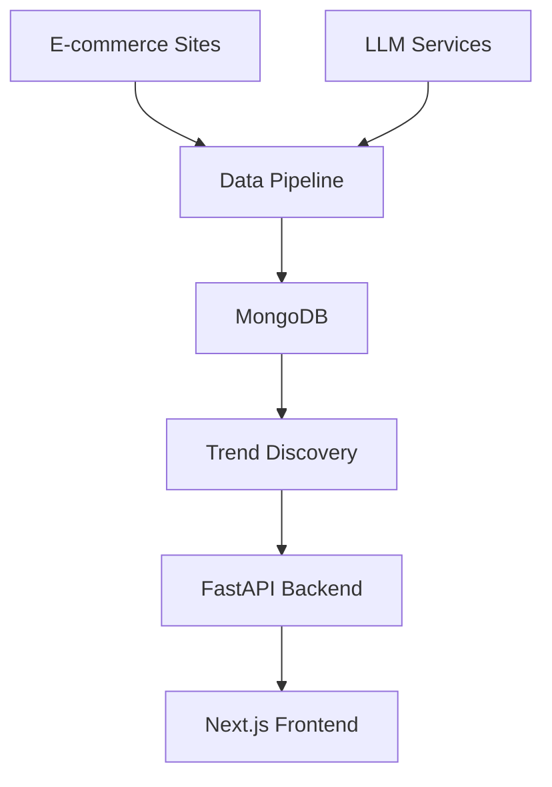

# 🎨 Looma: The Artisan Intelligence Platform

[](https://www.python.org/downloads/)
[](https://nextjs.org/)
[](https://fastapi.tiangolo.com/)

Looma is a cutting-edge full-stack application that empowers artisans (weavers) by connecting them with current fashion trends, potential models, and data-driven insights. It automates market research and provides an intelligent workspace for managing projects and resources.

## ✨ Core Features

### 🤖 Intelligent Data Processing

- **Automated Data Acquisition**: Advanced Python scrapers collect product data from e-commerce platforms
- **LLM-Powered Analysis**: Modern language models (Mistral/OpenAI) extract structured features from product descriptions
- **Smart Feature Extraction**: Automatically identifies techniques, motifs, categories, and pricing patterns

### 📊 Advanced Analytics

- **Data-Driven Trend Discovery**: Analyzes aggregated product data to identify valuable and popular trends
- **Price Impact Analysis**: Determines which features command higher prices in the market
- **Real-time Market Insights**: Provides up-to-date trend analysis and recommendations

### 🔍 Hybrid Search Engine

- **Dual-Mode Matching**: Combines keyword-based (BM25) and semantic vector-based (FAISS) search
- **Pre-computed Indexes**: Lightning-fast trend matching using cached data
- **Real-time Analysis**: On-demand trend generation from the latest product data

### 🎯 Interactive Dashboards

- **Artisan Portal**: Comprehensive project management and trend exploration interface
- **Student Model Hub**: Dedicated platform for models to manage profiles and connections
- **Responsive Design**: Beautiful, mobile-friendly interface built with modern web technologies

## 🏗️ Architecture



### Components Overview

1. **Data Pipeline** (`data_pipeline.py`)

   - 🕷️ **Scrape**: OgaanScraper and RawMangoScraper fetch product data
   - 🔄 **Process**: ProductFeatureExtractor uses LLMs for structured data extraction
   - 📤 **Load**: MongoUploader cleans and stores data in MongoDB

2. **Trend Discovery** (`trend_discovery_advanced.py`)

   - 📈 Analyzes product collections for trend identification
   - 💰 Calculates popularity and price impact metrics
   - 🎯 Generates top trends for the recommendation engine

3. **Backend API** (`main.py`)

   - ⚡ FastAPI server with high-performance endpoints
   - 🔍 In-memory BM25 and FAISS search indexes
   - 🔄 Real-time and cached trend matching capabilities

4. **Frontend** (`page.tsx`)
   - ⚛️ Modern Next.js application with TypeScript
   - 🎨 Elegant UI components with Framer Motion animations
   - 📱 Responsive design optimized for all devices

## 🛠️ Tech Stack

<table>
<tr>
<th>Frontend</th>
<th>Backend & Data Pipeline</th>
</tr>
<tr>
<td>

- ▲ **Next.js** - React framework
- ⚛️ **React** - UI library
- 📘 **TypeScript** - Type safety
- 💨 **Tailwind CSS** - Styling
- ✨ **Framer Motion** - Animations

</td>
<td>

- 🐍 **Python 3.11+** - Core language
- 🚀 **FastAPI** - Web framework
- 📦 **Uvicorn** - ASGI server
- 🍃 **MongoDB** - Database
- 🧠 **SentenceTransformers** - Embeddings
- 🔍 **Mistral AI / OpenAI** - LLM services
- ⚡ **FAISS** - Vector search
- 📝 **Rank-BM25** - Text search
- 🐼 **Pandas** - Data processing

</td>
</tr>
</table>

## 🚀 Quick Start

### Prerequisites

- 📦 **Node.js** (v18.x or later)
- 🐍 **Python** (v3.11 or later)
- 🍃 **MongoDB Atlas Account** (or local MongoDB)
- 🔑 **Mistral AI API Key** (or OpenAI key)

### 1. Backend Setup

```bash
# Clone the repository
git clone https://github.com/your-username/looma.git
cd looma/python_server

# Create and activate virtual environment
python -m venv venv
source venv/bin/activate  # On Windows: venv\Scripts\activate

# Start the FastAPI server
uvicorn main:app --reload
```

🎉 **Backend is now running at** `http://127.0.0.1:8000`

### 2. Frontend Setup

```bash
# Navigate to frontend directory
cd ../looma

# Install Node.js dependencies
npm install

# Start development server
npm run dev
```

🌟 **Frontend is now running at** `http://localhost:3000`

## 📡 API Reference

| Method | Endpoint                      | Description                          |
| ------ | ----------------------------- | ------------------------------------ |
| `GET`  | `/`                           | 🏥 Health check endpoint             |
| `GET`  | `/weavers`                    | 👥 Retrieve all sample weavers       |
| `GET`  | `/match/{weaver_id}`          | ⚡ Fast trend matches (pre-computed) |
| `GET`  | `/match/realtime/{weaver_id}` | 🔄 Real-time trend generation        |
| `POST` | `/scrape`                     | 🕷️ Trigger data acquisition pipeline |

### Example API Usage

```javascript
// Fetch trend matches for a weaver
const response = await fetch("/api/match/weaver123");
const trends = await response.json();

// Trigger data pipeline
const scrapeResponse = await fetch("/api/scrape", {
  method: "POST",
});
```

## 📁 Project Structure

```
looma/
├── 🐍 python_server/
│   ├── main.py                        # FastAPI application & endpoints
│   ├── trend_matcher.py               # Hybrid search engine
│   ├── data_pipeline.py               # Data acquisition orchestrator
│   ├── trend_discovery_advanced.py    # Trend analysis engine
│   ├── 🕷️ ingestion/                  # Web scraper modules
│   ├── 🔄 processing/                 # LLM feature extraction
│   └── 📦 model/                      # MongoDB integration
│
└── ▲ looma/
    └── src/
        ├── app/
        │   ├── page.tsx                    # Main artisan dashboard
        │   └── student-dashboard/
        │       └── page.tsx                # Student model portal
        └── components/
            ├── trend-analyzer.tsx          # Interactive trend component
            ├── model-candidates.tsx        # Model selection interface
            ├── set-price-modal.tsx         # Price setting modal
            └── ...                         # Additional UI components
```

## 🙏 Acknowledgments

- 🧠 **Mistral AI** for providing powerful language models
- 🔍 **Facebook AI** for the FAISS vector search library
- 🎨 **The open-source community** for amazing tools and libraries
- 👨‍💻 **All contributors** who help make Looma better

## 📞 Support

- 📧 **Email**: mohdarshilmbd1@gmail.com

---

<div align="center">

**Made with ❤️**

[Website](https://www.notion.so/arshiljustchill/Arshil-Projects-Portfolio-2339fb990cfe80b18438db582c5cf7ce) • [LinkedIn](https://www.linkedin.com/in/arshil-mohd/)

</div>
